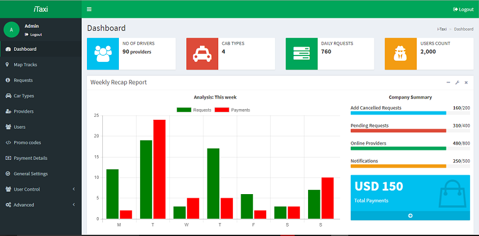

# Taxi-booking-admin-backend-template
Laravel based Taxi booking template for administrator.
Clone the repo and add the functionality to your taxi system and be up in no time.
The system uses laravel 5 and design is based on twitter bootstrap.

Some features of the system:-

Map View to allow tracking of vehicles

Vehicle types category

Provider/driver and users information

Visual representation using graphs ConsoleTVS library

Responsive design UI/UX

Prebuilt registration and login pages fully functional

...........

And many more features to help you advance in the development of the system

It also uses mysql database for data storage.

Ensure to change the database credentials in .env file.

Once you install the app run the following code inside the project directory:-

composer install

php artisan migrate

You can access the project on localhost or wherever server you installed on.

